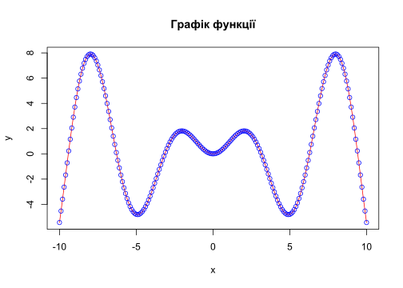
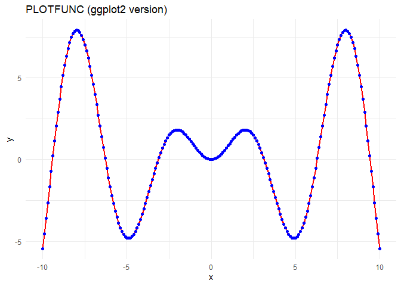
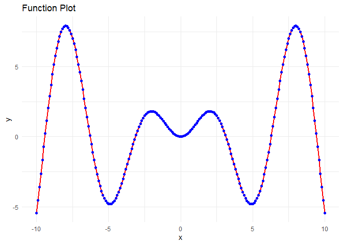

Lab2-ZVIT
================
Mykhailyk Maksym
2025-12-7

Лабораторна робота №2. Створення проєкту зі статистичної обробки даних у
стилі literate programming

Мета: швидкий старт для роботи в середовищі RStudio із застосуванням
концепції «грамотного програмування» засобами мови програмування R,
пакету RMarkdown та системи комп’ютерної верстки LaTeX.

``` r
# Задаємо параметри функції
b0 <- 2
b1 <- 3
b2 <- 1.57

# Задаємо область визначення

x <- seq(-10, 10, 0.1)
y <- sin(x) * x


plot(x, y,
     type = "l",
     col = "red",
     main = "Графік функції",
     xlab = "x",
     ylab = "y"
     )
points(x, y,
       col = "blue")
```

<!-- -->

``` r
df <- data.frame(x = x, y = y) 
```

``` r
library(rio)
```

    ## Warning: package 'rio' was built under R version 4.5.2

``` r
library(knitr)
```

    ## Warning: package 'knitr' was built under R version 4.5.2

``` r
export(df, "data/data.csv")
knitr::kable(head(df), caption = "Табл. 1. Фрагмент даних", align = "c")
```

|   x   |     y      |
|:-----:|:----------:|
| -10.0 | -5.4402111 |
| -9.9  | -4.5296053 |
| -9.8  | -3.5914955 |
| -9.7  | -2.6360781 |
| -9.6  | -1.6735371 |
| -9.5  | -0.7139356 |

Табл. 1. Фрагмент даних

``` r
dfNew <- import("data/data.csv")
# Таблиця засобами knitr
knitr::kable(head(dfNew),
caption = "_Табл. 1. Фрагмент таблиці даних_")
```

|     x |          y |
|------:|-----------:|
| -10.0 | -5.4402111 |
|  -9.9 | -4.5296053 |
|  -9.8 | -3.5914955 |
|  -9.7 | -2.6360781 |
|  -9.6 | -1.6735371 |
|  -9.5 | -0.7139356 |

*Табл. 1. Фрагмент таблиці даних*

Таблиця засобами stargazer

``` r
 stargazer::stargazer(head(dfNew),
 type = "html",
 summary = FALSE,
 title = "_Табл. 1. Фрагмент таблиці даних_")
```

<table style="text-align:center">

<caption>

<strong>1. Фрагмент таблиці даних</strong>
</caption>

<tr>

<td colspan="3" style="border-bottom: 1px solid black">

</td>

</tr>

<tr>

<td style="text-align:left">

</td>

<td>

x
</td>

<td>

y
</td>

</tr>

<tr>

<td colspan="3" style="border-bottom: 1px solid black">

</td>

</tr>

<tr>

<td style="text-align:left">

1
</td>

<td>

-10
</td>

<td>

-5.440
</td>

</tr>

<tr>

<td style="text-align:left">

2
</td>

<td>

-9.900
</td>

<td>

-4.530
</td>

</tr>

<tr>

<td style="text-align:left">

3
</td>

<td>

-9.800
</td>

<td>

-3.591
</td>

</tr>

<tr>

<td style="text-align:left">

4
</td>

<td>

-9.700
</td>

<td>

-2.636
</td>

</tr>

<tr>

<td style="text-align:left">

5
</td>

<td>

-9.600
</td>

<td>

-1.674
</td>

</tr>

<tr>

<td style="text-align:left">

6
</td>

<td>

-9.500
</td>

<td>

-0.714
</td>

</tr>

<tr>

<td colspan="3" style="border-bottom: 1px solid black">

</td>

</tr>

</table>

Таблиця засобами xtable

``` r
library(xtable)
print(xtable(head(df)), type = "html")
```

<!-- html table generated in R 4.5.1 by xtable 1.8-4 package -->

<!-- Sun Dec  7 02:40:10 2025 -->

<table border="1">

<tr>

<th>

</th>

<th>

x
</th>

<th>

y
</th>

</tr>

<tr>

<td align="right">

1
</td>

<td align="right">

-10.00
</td>

<td align="right">

-5.44
</td>

</tr>

<tr>

<td align="right">

2
</td>

<td align="right">

-9.90
</td>

<td align="right">

-4.53
</td>

</tr>

<tr>

<td align="right">

3
</td>

<td align="right">

-9.80
</td>

<td align="right">

-3.59
</td>

</tr>

<tr>

<td align="right">

4
</td>

<td align="right">

-9.70
</td>

<td align="right">

-2.64
</td>

</tr>

<tr>

<td align="right">

5
</td>

<td align="right">

-9.60
</td>

<td align="right">

-1.67
</td>

</tr>

<tr>

<td align="right">

6
</td>

<td align="right">

-9.50
</td>

<td align="right">

-0.71
</td>

</tr>

</table>

Формуємо результуючу таблицю

``` r
tab_params <- data.frame(
  Параметр = c("$b_0$", "$b_1$", "$b_2$", "$x_{min}$", "$x_{max}$"),
  Значення = c(b0, b1, b2, min(x), max(x)) 
)


knitr::kable(tab_params, 
             caption = "Табл. 2. Параметри функції", 
             escape = FALSE,
             align = "c")   
```

| Параметр  | Значення |
|:---------:|:--------:|
|   $b_0$   |   2.00   |
|   $b_1$   |   3.00   |
|   $b_2$   |   1.57   |
| $x_{min}$ |  -10.00  |
| $x_{max}$ |  10.00   |

Табл. 2. Параметри функції

**3 . Оптимізувати код, наведений у цій методичці, за допомогою
потокового оператора %\>% засобами пакету ggplot2.**

``` r
library(dplyr)
library(ggplot2)
library(DT)
library(knitr)

b0 <- 2
b1 <- 3
b2 <- 1.57

df <- data.frame(x = seq(-10, 10, 0.1)) %>%
  mutate(y = sin(x) * x)

plot_obj <- df %>%
  ggplot(aes(x = x, y = y)) +
  geom_line(color = "red", size = 1) +
  geom_point(color = "blue", size = 1.5) +
  labs(title = "PLOTFUNC (ggplot2 version)",
       x = "x",
       y = "y") +
  theme_minimal()

print(plot_obj)
```

<!-- -->

``` r
  df %>%
  knitr::kable(caption = "Таблиця 1. Фрагмент даних", align = "c")
```

|   x   |     y      |
|:-----:|:----------:|
| -10.0 | -5.4402111 |
| -9.9  | -4.5296053 |
| -9.8  | -3.5914955 |
| -9.7  | -2.6360781 |
| -9.6  | -1.6735371 |
| -9.5  | -0.7139356 |
| -9.4  | 0.2328890  |
| -9.3  | 1.1574261  |
| -9.2  | 2.0505872  |
| -9.1  | 2.9037951  |
| -9.0  | 3.7090664  |
| -8.9  | 4.4590856  |
| -8.8  | 5.1472713  |
| -8.7  | 5.7678323  |
| -8.6  | 6.3158150  |
| -8.5  | 6.7871405  |
| -8.4  | 7.1786308  |
| -8.3  | 7.4880262  |
| -8.2  | 7.7139906  |
| -8.1  | 7.8561075  |
| -8.0  | 7.9148660  |
| -7.9  | 7.8916366  |
| -7.8  | 7.7886381  |
| -7.7  | 7.6088954  |
| -7.6  | 7.3561895  |
| -7.5  | 7.0349998  |
| -7.4  | 6.6504399  |
| -7.3  | 6.2081873  |
| -7.2  | 5.7144086  |
| -7.1  | 5.1756802  |
| -7.0  | 4.5989062  |
| -6.9  | 3.9912344  |
| -6.8  | 3.3599708  |
| -6.7  | 2.7124945  |
| -6.6  | 2.0561730  |
| -6.5  | 1.3982799  |
| -6.4  | 0.7459149  |
| -6.3  | 0.1059276  |
| -6.2  | -0.5151543 |
| -6.1  | -1.1111913 |
| -6.0  | -1.6764930 |
| -5.9  | -2.2058723 |
| -5.8  | -2.6946926 |
| -5.7  | -3.1389076 |
| -5.6  | -3.5350932 |
| -5.5  | -3.8804718 |
| -5.4  | -4.1729282 |
| -5.3  | -4.4110174 |
| -5.2  | -4.5939642 |
| -5.1  | -4.7216549 |
| -5.0  | -4.7946214 |
| -4.9  | -4.8140178 |
| -4.8  | -4.7815901 |
| -4.7  | -4.6996393 |
| -4.6  | -4.5709786 |
| -4.5  | -4.3988855 |
| -4.4  | -4.1870491 |
| -4.3  | -3.9395135 |
| -4.2  | -3.6606182 |
| -4.1  | -3.3549362 |
| -4.0  | -3.0272100 |
| -3.9  | -2.6822880 |
| -3.8  | -2.3250600 |
| -3.7  | -1.9603937 |
| -3.6  | -1.5930736 |
| -3.5  | -1.2277413 |
| -3.4  | -0.8688397 |
| -3.3  | -0.5205608 |
| -3.2  | -0.1867973 |
| -3.1  | 0.1289001  |
| -3.0  | 0.4233600  |
| -2.9  | 0.6938231  |
| -2.8  | 0.9379668  |
| -2.7  | 1.1539257  |
| -2.6  | 1.3403036  |
| -2.5  | 1.4961804  |
| -2.4  | 1.6211116  |
| -2.3  | 1.7151220  |
| -2.2  | 1.7786921  |
| -2.1  | 1.8127397  |
| -2.0  | 1.8185949  |
| -1.9  | 1.7979702  |
| -1.8  | 1.7529257  |
| -1.7  | 1.6858302  |
| -1.6  | 1.5993178  |
| -1.5  | 1.4962425  |
| -1.4  | 1.3796296  |
| -1.3  | 1.2526256  |
| -1.2  | 1.1184469  |
| -1.1  | 0.9803281  |
| -1.0  | 0.8414710  |
| -0.9  | 0.7049942  |
| -0.8  | 0.5738849  |
| -0.7  | 0.4509524  |
| -0.6  | 0.3387855  |
| -0.5  | 0.2397128  |
| -0.4  | 0.1557673  |
| -0.3  | 0.0886561  |
| -0.2  | 0.0397339  |
| -0.1  | 0.0099833  |
|  0.0  | 0.0000000  |
|  0.1  | 0.0099833  |
|  0.2  | 0.0397339  |
|  0.3  | 0.0886561  |
|  0.4  | 0.1557673  |
|  0.5  | 0.2397128  |
|  0.6  | 0.3387855  |
|  0.7  | 0.4509524  |
|  0.8  | 0.5738849  |
|  0.9  | 0.7049942  |
|  1.0  | 0.8414710  |
|  1.1  | 0.9803281  |
|  1.2  | 1.1184469  |
|  1.3  | 1.2526256  |
|  1.4  | 1.3796296  |
|  1.5  | 1.4962425  |
|  1.6  | 1.5993178  |
|  1.7  | 1.6858302  |
|  1.8  | 1.7529257  |
|  1.9  | 1.7979702  |
|  2.0  | 1.8185949  |
|  2.1  | 1.8127397  |
|  2.2  | 1.7786921  |
|  2.3  | 1.7151220  |
|  2.4  | 1.6211116  |
|  2.5  | 1.4961804  |
|  2.6  | 1.3403036  |
|  2.7  | 1.1539257  |
|  2.8  | 0.9379668  |
|  2.9  | 0.6938231  |
|  3.0  | 0.4233600  |
|  3.1  | 0.1289001  |
|  3.2  | -0.1867973 |
|  3.3  | -0.5205608 |
|  3.4  | -0.8688397 |
|  3.5  | -1.2277413 |
|  3.6  | -1.5930736 |
|  3.7  | -1.9603937 |
|  3.8  | -2.3250600 |
|  3.9  | -2.6822880 |
|  4.0  | -3.0272100 |
|  4.1  | -3.3549362 |
|  4.2  | -3.6606182 |
|  4.3  | -3.9395135 |
|  4.4  | -4.1870491 |
|  4.5  | -4.3988855 |
|  4.6  | -4.5709786 |
|  4.7  | -4.6996393 |
|  4.8  | -4.7815901 |
|  4.9  | -4.8140178 |
|  5.0  | -4.7946214 |
|  5.1  | -4.7216549 |
|  5.2  | -4.5939642 |
|  5.3  | -4.4110174 |
|  5.4  | -4.1729282 |
|  5.5  | -3.8804718 |
|  5.6  | -3.5350932 |
|  5.7  | -3.1389076 |
|  5.8  | -2.6946926 |
|  5.9  | -2.2058723 |
|  6.0  | -1.6764930 |
|  6.1  | -1.1111913 |
|  6.2  | -0.5151543 |
|  6.3  | 0.1059276  |
|  6.4  | 0.7459149  |
|  6.5  | 1.3982799  |
|  6.6  | 2.0561730  |
|  6.7  | 2.7124945  |
|  6.8  | 3.3599708  |
|  6.9  | 3.9912344  |
|  7.0  | 4.5989062  |
|  7.1  | 5.1756802  |
|  7.2  | 5.7144086  |
|  7.3  | 6.2081873  |
|  7.4  | 6.6504399  |
|  7.5  | 7.0349998  |
|  7.6  | 7.3561895  |
|  7.7  | 7.6088954  |
|  7.8  | 7.7886381  |
|  7.9  | 7.8916366  |
|  8.0  | 7.9148660  |
|  8.1  | 7.8561075  |
|  8.2  | 7.7139906  |
|  8.3  | 7.4880262  |
|  8.4  | 7.1786308  |
|  8.5  | 6.7871405  |
|  8.6  | 6.3158150  |
|  8.7  | 5.7678323  |
|  8.8  | 5.1472713  |
|  8.9  | 4.4590856  |
|  9.0  | 3.7090664  |
|  9.1  | 2.9037951  |
|  9.2  | 2.0505872  |
|  9.3  | 1.1574261  |
|  9.4  | 0.2328890  |
|  9.5  | -0.7139356 |
|  9.6  | -1.6735371 |
|  9.7  | -2.6360781 |
|  9.8  | -3.5914955 |
|  9.9  | -4.5296053 |
| 10.0  | -5.4402111 |

Таблиця 1. Фрагмент даних

``` r
data.frame(
  Параметр = c("$b_0$", "$b_1$", "$b_2$", "$x_{min}$", "$x_{max}$"),
  Значення = c(b0, b1, b2, min(df$x), max(df$x))
) %>%
  knitr::kable(caption = "Табл. 2. Параметри функції",
        escape = FALSE,
        align = "c")
```

| Параметр  | Значення |
|:---------:|:--------:|
|   $b_0$   |   2.00   |
|   $b_1$   |   3.00   |
|   $b_2$   |   1.57   |
| $x_{min}$ |  -10.00  |
| $x_{max}$ |  10.00   |

Табл. 2. Параметри функції

**4 . Побудувати графік функції засобами пакету ggplot2.**

``` r
library(ggplot2)

x_vals <- seq(-10, 10, by = 0.1)
y_vals <- sin(x_vals) * x_vals

df <- data.frame(x = x_vals, y = y_vals)

ggplot(df, aes(x = x, y = y)) +
  geom_line(color = "red", size = 1) +
  geom_point(color = "blue", size = 1.5) +
  labs(title = "Function Plot", x = "x", y = "y") +
  theme_minimal()
```

<!-- -->

<center>

**Контрольні питання**
</center>

1 . Напишіть код на LaTeX для формули щільності нормального розподілу -
$$ f(x) = \frac{1}{\sigma\sqrt{2\pi}} e^{-\frac{1}{2}\left(\frac{x-\mu}{\sigma}\right)^2} $$

2 . Як розв’язати таблиці і графіки в електронний документ з
використанням R Markdown і пакету rmarkdown з оглядом на читабельність
та грамотність коду? - Для цього треба : 1-Налаштувати структуру 2 -
Грамтно писати код , використовувати %\>% та ggplot2 3 - використовувати
для коротких зведень і параметрів статичну функцію knitr::kable, а для
великих масивів даних — інтерактивну DT::datatable, яка дозволяє гортати
та фільтрувати рядки.

3 . Як вирішити завдання зі вставленням та форматуванням зображень
велектронному документі з використанням R, забезпечуючи читабельність
таелегантність коду? - Для цього підійде використання функції
knitr::include_graphics().Або якщо не треба форматувати то підійде .

4 . Яку функцію виконує YAML-заголовок у динамічному документі? -
головними функціями є - 1.Визначення кінцевого формату 2.Налаштування
зовнішнього вигляду документу.3.Збереження мета даних(title,author,date)
