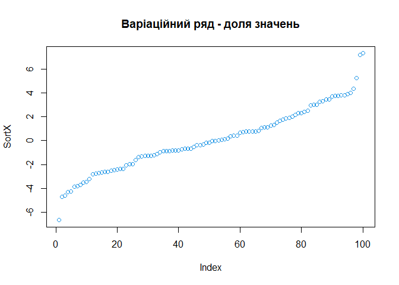
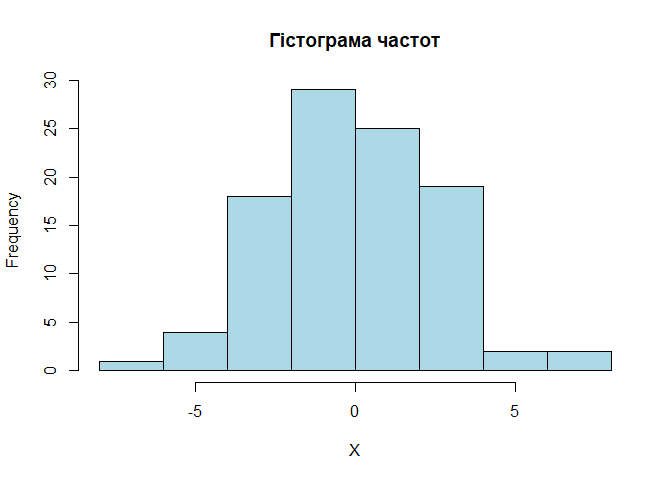
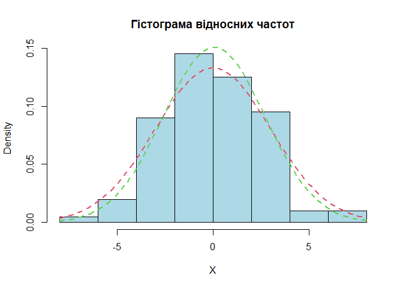
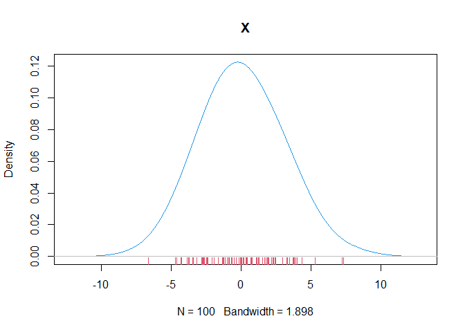
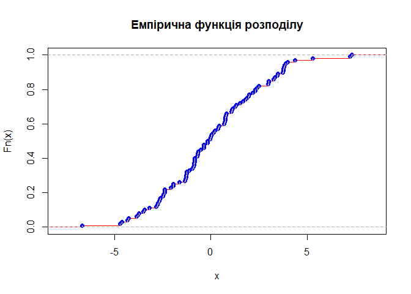
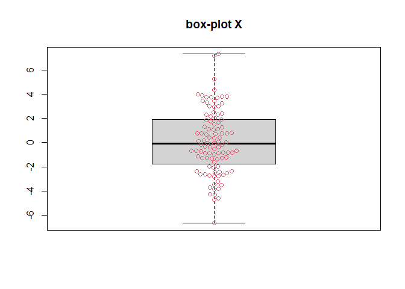

Lab3-ZVIT
================
Mykhailyk Maksym
2025-12-7

**Лабораторна робота № 3**

**Тема. Основи вибіркового методу**

**Мета : засвоїти основи статистичного оцінювання характеристик
випадкової величини на основі вибіркового підходу засобами мови
програмування R; набути навичок роботи у середовищі RStudio із
застосуванням концепції “грамотного програмування” із застосуванням
пакету R Markdown.**

**1 . Постановка задачі.**

Випадкова величина X має нормальний закон розподілу: X∼F(a,σ2), тобто
X∼N(a,σ2), вектор параметрів Θ=(a,σ2) якого відомий: (a,σ2)=( 0 , 3 ) .
Тобто, a= 0, σ2= 3. Згенерувати дві вибірки випадкової величини X за
допомогою відповідного генератору псевдовипадкових чисел: (x1,x2,…,xn)
відповідно обсягів n=100 та n=1000, що мають розподіл X∼N( 0, 9 ),
обчислити і дослідити оцінки параметрів розподілу
a<sub>=a</sub>(x1,x2,…,xn)≈a, σ<sub>=σ</sub>(x1,x2,…,xn)=σ та інші
статистичні характеристики, зробити порівняльний аналіз оцінених
характеристик між собою і з теоретичними характеристиками.

**2 . Генеруємо вибірку з нормального розподілу з параметрами a= 0, σ= 3
об’єму n= 100 та будуємо варіаційни ряд для неї**

``` r
set.seed(0) 
n <- 100  
a <- 0  
s <- 3 
X <- rnorm(n, a, s)
cat("\n", "Параметри вибірки:", "\n", "a = ", a, "\n" , "s = ", s, "\n" , "n = ", n, "\n")
```

    ## 
    ##  Параметри вибірки: 
    ##  a =  0 
    ##  s =  3 
    ##  n =  100

``` r
cat("Перші елементи вибірки:", head(X))
```

    ## Перші елементи вибірки: 3.788863 -0.9787001 3.989398 3.817288 1.243924 -4.61985

``` r
cat("Останні елементи вибірки:", tail(X))
```

    ## Останні елементи вибірки: 1.788777 0.3591529 -0.8465216 4.367965 0.6870588 2.989632

``` r
SortX <- sort(X)
plot(SortX, col=4)
title("Варіаційний ряд - доля значень")
```

<!-- -->

**3 . Будуємо інтервальний статистичний розподіл і гістограму частот.**

``` r
1 + 1.332 * log(n)
```

    ## [1] 7.134087

``` r
table(cut(X, nclass.Sturges(X)))
```

    ## 
    ## (-6.69,-4.92] (-4.92,-3.17] (-3.17,-1.42] (-1.42,0.326]  (0.326,2.08] 
    ##             1            10            15            30            21 
    ##   (2.08,3.83]   (3.83,5.57]   (5.57,7.34] 
    ##            17             4             2

``` r
hist(X, breaks=nclass.Sturges(X),
     col="Lightblue",
     main="Гістограма частот")
```

<!-- -->

``` r
hist(X,
     freq = FALSE,
     col = "Lightblue",
     main = "Гістограма відносних частот")
curve(dnorm(x, a, s), col = 2, lty = 2, lwd = 2, add = TRUE) 
curve(dnorm(x, mean(X), sd(X)), col = 3, lty = 2, lwd = 2, add = TRUE)
```

<!-- -->

**4 . Виводимо сумарні статистики**

``` r
summary(X)
```

    ##     Min.  1st Qu.   Median     Mean  3rd Qu.     Max. 
    ## -6.67170 -1.70826 -0.09888  0.06801  1.87605  7.32409

Альтернативний варіант за допомогою спеціальних функцій

``` r
mean(X)
```

    ## [1] 0.06800535

``` r
sd(X)
```

    ## [1] 2.647951

``` r
IQR(X)
```

    ## [1] 3.584309

| Характеристика              | Значення  |
|-----------------------------|-----------|
| $\tilde{m}(x)$              | 0.0680053 |
| $\tilde{\tilde{\sigma}}(x)$ | 2.6479506 |
| $\tilde{R}$                 | 3.5843093 |

Таблиця 2 – **Числові характеристики вибірки**

``` r
library(Hmisc)
```

    ## Warning: package 'Hmisc' was built under R version 4.5.2

    ## 
    ## Attaching package: 'Hmisc'

    ## The following objects are masked from 'package:base':
    ## 
    ##     format.pval, units

``` r
describe(X)
```

    ## X 
    ##        n  missing distinct     Info     Mean  pMedian      Gmd      .05 
    ##      100        0      100        1  0.06801 0.003253    2.999 -3.87487 
    ##      .10      .25      .50      .75      .90      .95 
    ## -3.22139 -1.70826 -0.09888  1.87605  3.71965  3.90251 
    ## 
    ## lowest : -6.6717  -4.69135 -4.61985 -4.31276 -4.2753 
    ## highest: 3.9894   4.36797  5.27371  7.21396  7.32409

Варіант з власною функцією

``` r
library(moments)
```

    ## Warning: package 'moments' was built under R version 4.5.2

``` r
my_summary <- function(X, ...) {
  cat("\n", "Оцінки статистичних характеристик вибірки:", "\n", 
      "вибіркове математичне сподівання, m = ", mean(X), "\n",
      "Медіана, Ме = ", median(X) , "\n",
      "вибіркова дисперсія, s^2 = ", var(X), "\n" ,
      "вибіркове СКВ, s = ", sd(X), "\n" ,
      "Розмах, R = ", max(X) - min(X), "\n" ,
      "Інтерквартільний розмах, IQR = ", IQR(X), "\n",
      "Ексцес, Ek = ", kurtosis(X), "\n",
      "Асиметрія, As= ", skewness(X), "\n"
    )
}

my_summary(X,  na.rm=FALSE)
```

    ## 
    ##  Оцінки статистичних характеристик вибірки: 
    ##  вибіркове математичне сподівання, m =  0.06800535 
    ##  Медіана, Ме =  -0.09888443 
    ##  вибіркова дисперсія, s^2 =  7.011642 
    ##  вибіркове СКВ, s =  2.647951 
    ##  Розмах, R =  13.99579 
    ##  Інтерквартільний розмах, IQR =  3.584309 
    ##  Ексцес, Ek =  2.959992 
    ##  Асиметрія, As=  0.2273757

**5 . Створюємо представлення теоретичного і емпіричного розподілів.**

``` r
plot(density(X, adjust=2), main="X", col=4)
rug(X, col=2) 
```

<!-- -->

``` r
Fn <- ecdf(X)


plot(Fn,
     verticals = TRUE,
     col.points = "blue",
     col.hor = "red",
     col.vert = "bisque",
     main = "Емпірична функція розподілу")
```

<!-- -->

**6 . Побудуємо боксплоти**

``` r
library(beeswarm)
```

    ## Warning: package 'beeswarm' was built under R version 4.5.2

``` r
boxplot(X, main="box-plot X")  
beeswarm(X, col=2, add=TRUE) 
```

<!-- -->

**7 . Виконаємо компактний варіант виводу основних графіків вибіркових
характеристик**

``` r
library(beeswarm)
library(moments)
# --- КОНЕЦ ИСПРАВЛЕНИЯ ---

# Восстанавливаем данные (на случай, если R "забыл" их из прошлых шагов)
if (!exists("X")) {
  set.seed(0)
  n <- 100
  a <- 0
  s <- 3
  X <- rnorm(n, a, s)
  Fn <- ecdf(X)
}

# Строим графики
op <- par(mfrow = c(2,2))

# 1. Гистограмма
hist(X, freq = FALSE, col = "Lightgray", main="Histogram", border=4)
curve(dnorm(x, a, s), col = 2, lty = 2, lwd = 2, add = TRUE)

# 2. Квантили
plot(Fn, main = "Quantile Plot", verticals = TRUE, col.points = "blue", col.hor = "red", col.vert = "bisque", xlab = "X", ylab = "Fn(x)")

# 3. Боксплот + Beeswarm (тут была ошибка)
boxplot(X, main = "Box-and-Wisker Plot", col = "Lightgray", border = 4, xlab = "X", ylab = "", horizontal = TRUE)
beeswarm(X, col = 2, add = TRUE, horizontal = TRUE)

# 4. Плотность
plot(density(X, adjust=2), main = "density trace", xlab = "X", ylab = "Dencity", col="blue")
rug(X, col=2)
```

<!-- -->

``` r
par(op)
```

**8 . Створюємо результуючу таблицю**

| Назва числової характеристики | теоретичне значення | Вибіркове значення, $n=$ 100 | Вибіркове значення, $n=1000$ |
|----|----|----|----|
| $a$ | 0 | 0.0680053 | $\tilde a$ |
| $\sigma$ | 3 | 2.6479506 | ${\tilde{\sigma}}$ |
| Математичне сподівання | 0 | 0.0680053 | $\tilde{m}(x)$ |
| Дисперсія | 9 | 7.0116423 | $\tilde{D}(x)$ |
| Виправлена дисперсія |  | 7.0824669 | $\tilde{\tilde{D}}(x)$ |
| СКВ | 3 | 2.6479506 | $\tilde{\sigma}(x)$ |
| Виправлене СКВ |  | 2.6612905 | $\tilde{\tilde\sigma}(x)$ |
| Центральний момент $3$-го порядку | $\mu_3$ | $\tilde{\mu}_3$ | $\tilde{\mu}_3$ |
| Центральний момент $4$-го порядку | $\mu_4$ | $\tilde{\mu}_4$ | $\tilde{\mu}_4$ |
| Асимерія | $A_s$ | $\tilde{A}_s$ | $\tilde{A}_s$ |
| Ексцес | $E_k$ | $\tilde{E}_k$ | $\tilde{E}_k$ |

Таблиця 3 – **Теоретичні та емпіричні (вибіркові) числові характеристики
випадкової величини**

<center>

**9 . Контрольні питання**
<center>

1.  Що таке вибірка? - це частина об’єктів генеральної сукупності,
    відібраних для спостереження, щоб отримати інформацію про
    властивості всієї сукупності.

2.  Як можна оцінити вибіркове математичне сподівання? - Вибіркове
    математичне сподівання оцінюється через вибіркове середнє , яке в R
    обчислюється функцією mean(X). Це точка, навколо якої групуються
    значення вибірки.

3.  Які існують міри розсіювання? - Основні міри розсіювання — це
    дисперсія (s2) та середнє квадратичне відхилення (s), які показують
    міру коливання даних навколо середнього. Також існують розмах (R) та
    інтерквартильний розмах (IQR).

4.  Які міри форми розподілу вам відомі? Що вони характеризують? Як їх
    оцінити на практиці? - Асиметрія та ексцес . Асиметрія характеризує
    симетричність розподілу відносно центру. Вона показує, в який бік
    перекошений графік.Ексцес характеризує гостроверхість піку розподілу
    та важкість хвостів порівняно з нормальним розподілом.На практиці ми
    оцінюємо їх за допомогою функцій skewness() та kurtosis() або
    візуально за гістограмою.

**10 . Висновок**

На данному лабараторному занятті засвоїли основи статистичного
оцінювання характеристик випадкової величини на основі вибіркового
підходу засобами мови програмування R; набули навичок роботи у
середовищі RStudio із застосуванням концепції “грамотного програмування”
із застосуванням пакету R Markdown.
