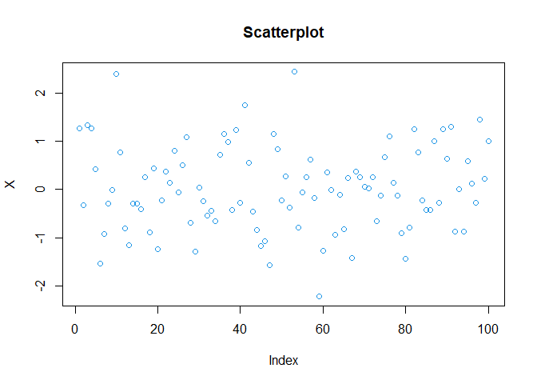
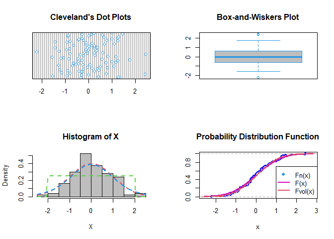
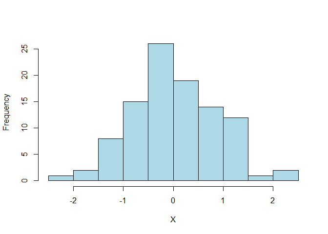
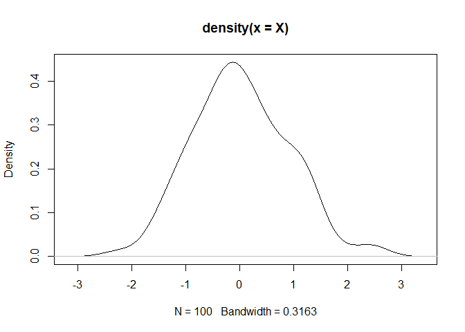
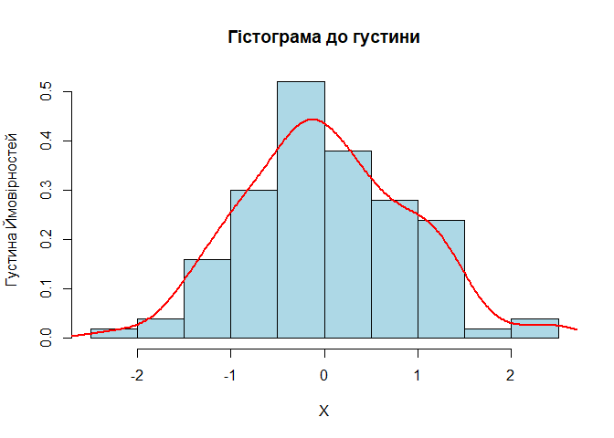
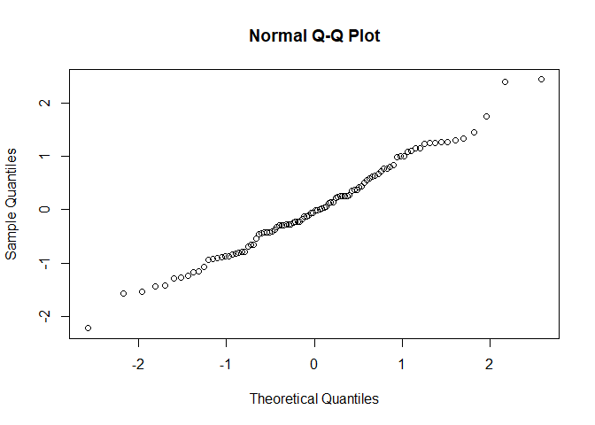
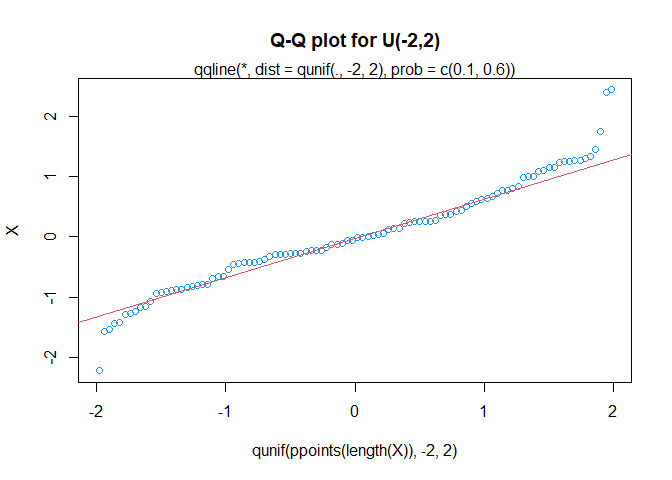

LB_4
================
Mykhailyk Maksym
2025-12-07

**Лабораторна робота №4**

**Тема: Перевірка статистичних гіпотез щодо закону розподілу. Перевірка
на нормальність**

**Мета: засвоїти ідею методики перевірки статистичних гіпотез щодо
закону розподілу випадкової величини засобами мови програмування R;
набути навичок роботи у середовищі RStudio із застосуванням концепції
“грамотного програмування” із застосуванням пакету R Markdown.**

**1 . Постановка задачі.**

Випадкова величина X має заданий закон розподілу, вектор параметрів
якого відомий. Згенерувати згідно з варіантом вибірку випадкової
величини X=(x1,…,xn): спочатку об’єму n=50, що має заданий розподіл,
обчислити оцінку вектора параметрів розподілу. Висунити і перевірити
статистичну гіпотезу щодо нормального закону розподілу величини X:
H0:f(x)∈{N(x,μ,σ2),μ∈μ,σ2∈Σ2} H1:f(x)∉{N(x,μ,σ2),μ∈μ,σ2∈Σ2}

Повторити дослідження для n=1000 . Порівняти результати, зробити
висновки.

**2 . Генеруємо вибірку за допомогою генератора випадкових чисел і
записуємо дані у файл**

``` r
set.seed(0)
a <- 0
s <- 1
n <- 100
X <- rnorm(n, a, s) #генерируем выборку
head(X)
```

    ## [1]  1.2629543 -0.3262334  1.3297993  1.2724293  0.4146414 -1.5399500

``` r
if(!dir.exists("data")) {
  dir.create("data")
}
write.table(file = "data/X3.csv", X,
            row.names = FALSE,
            dec = ".",
            col.names = FALSE,
            sep = ";",
            quote = FALSE)
rm(X)
X <- read.table("data/X3.csv")
X <- as.numeric(X$V1)

head(X)
```

    ## [1]  1.2629543 -0.3262334  1.3297993  1.2724293  0.4146414 -1.5399500

``` r
tail(X)
```

    ## [1]  0.5962590  0.1197176 -0.2821739  1.4559884  0.2290196  0.9965439

``` r
plot(X, main = "Scatterplot", col = 4)
```

<!-- -->

**2 . Обчислюємо вибіркові числові характеристики.**

``` r
get_distribution_stats <- function(x, na.rm = TRUE) {
  
  if (na.rm) x <- na.omit(x)
  

  n <- length(x)
  
  
  if (n < 4) {
    stop("Розмір вибірки має бути не менше 4 елементів для розрахунку ексцесу.")
  }
  
  mean_x <- mean(x)
  sd_x <- sd(x)
  
  dev <- x - mean_x
  sum_pow3 <- sum(dev^3)
  sum_pow4 <- sum(dev^4)
  
  
  
  skew <- (n * sum_pow3) / ((n - 1) * (n - 2) * sd_x^3)
  

  term1 <- (n * (n + 1) * sum_pow4) / ((n - 1) * (n - 2) * (n - 3) * sd_x^4)
  term2 <- (3 * (n - 1)^2) / ((n - 2) * (n - 3))
  kurt <- term1 - term2
  
  
  se_skew <- sqrt((6 * n * (n - 1)) / ((n - 2) * (n + 1) * (n + 3)))
  se_kurt <- 2 * se_skew * sqrt((n^2 - 1) / ((n - 3) * (n + 5)))
  

  z_skew <- skew / se_skew
  z_kurt <- kurt / se_kurt
  
 
  result <- c(
    Skewness = skew,
    SE_Skew = se_skew,
    Z_Skew_Score = z_skew,
    
    Kurtosis = kurt,
    SE_Kurt = se_kurt,
    Z_Kurt_Score = z_kurt
  )
  
  return(round(result, 4)) 
}

stats <- get_distribution_stats(X)


print(stats)
```

    ##     Skewness      SE_Skew Z_Skew_Score     Kurtosis      SE_Kurt Z_Kurt_Score 
    ##       0.2309       0.2414       0.9564       0.0204       0.4783       0.0427

``` r
get_full_stats <- function(x) {
  x <- na.omit(x)
  n <- length(x)
  
  if (n < 4) stop("Розмір вибірки має бути не менше 4")
  
  mean_val <- mean(x)
  var_val <- var(x)
  sd_val <- sd(x)
  
  dev <- x - mean_val
  sum_pow3 <- sum(dev^3)
  sum_pow4 <- sum(dev^4)
  
  skew <- (n * sum_pow3) / ((n - 1) * (n - 2) * sd_val^3)
  
  term1 <- (n * (n + 1) * sum_pow4) / ((n - 1) * (n - 2) * (n - 3) * sd_val^4)
  term2 <- (3 * (n - 1)^2) / ((n - 2) * (n - 3))
  kurt <- term1 - term2
  
  se_skew <- sqrt((6 * n * (n - 1)) / ((n - 2) * (n + 1) * (n + 3)))
  se_kurt <- 2 * se_skew * sqrt((n^2 - 1) / ((n - 3) * (n + 5)))
  
  z_skew <- skew / se_skew
  z_kurt <- kurt / se_kurt
  
  data.frame(
    Показник = c("Математичне сподівання", "Дисперсія", "СКВ", 
                 "Асиметрія", "Ексцес", 
                 "Z-значення Асиметрії", "Z-значення Ексцесу"),
    Значення = round(c(mean_val, var_val, sd_val, skew, kurt, z_skew, z_kurt), 4)
  )
}

 print(get_full_stats(X))
```

    ##                 Показник Значення
    ## 1 Математичне сподівання   0.0227
    ## 2              Дисперсія   0.7791
    ## 3                    СКВ   0.8827
    ## 4              Асиметрія   0.2309
    ## 5                 Ексцес   0.0204
    ## 6   Z-значення Асиметрії   0.9564
    ## 7     Z-значення Ексцесу   0.0427

``` r
summary(X)
```

    ##     Min.  1st Qu.   Median     Mean  3rd Qu.     Max. 
    ## -2.22390 -0.56942 -0.03296  0.02267  0.62535  2.44136

``` r
mean(X)
```

    ## [1] 0.02266845

``` r
sd(X)
```

    ## [1] 0.8826502

``` r
op <- par(mfrow = c(2,2)) 
dotchart(X, main = "Cleveland's Dot Plots", col = 4) 


boxplot(X, width = 2,
        range = 1, 
        col = "gray",
        border = 4, 
        main = "Box-and-Wiskers Plot")


hist(X, freq = FALSE,
     breaks = nclass.Sturges(X),
     col = "grey")
curve(dnorm(x, a, s),
      col = 2, 
      lty = 2, 
      lwd = 2, 
      add = TRUE) 
curve(dunif(x, -2, 2),
      col = 3, 
      lty = 2, 
      lwd = 2, 
      add = TRUE) 
curve(dt(x, df=10),
      col = 4,
      lty = 2,
      lwd = 2,
      add = TRUE) 


Fn <- ecdf(X)
plot(Fn,
     ylab = "",
     verticals = TRUE, 
     col.points = "blue",
     col.hor = "red",
     col.vert = "bisque",
     main = "Probability Distribution Function")
curve(pnorm(x, a, s),
      col = 6,
      lty = 1,
      lwd = 2,
      add = TRUE) 

curve(pnorm(x, mean(X), sd(X)),
      col = 2,
      lty = 1,
      lwd = 2,
      add = TRUE) 


legend("bottomright",
       pch = c(19, NA, NA),
       legend = c("Fn(x)", "F(x)","Fvol(x)"),
       lty = c(1,1,1), col = c(4,6,2), lwd = c(NA,2,2))
```

<!-- -->

``` r
par(op)
```

Будуємо гістограму

``` r
table(cut(X, nclass.Sturges(X))) 
```

    ## 
    ##  (-2.23,-1.64]  (-1.64,-1.06] (-1.06,-0.474] (-0.474,0.109]  (0.109,0.692] 
    ##              1             10             15             30             21 
    ##   (0.692,1.28]    (1.28,1.86]    (1.86,2.45] 
    ##             17              4              2

``` r
hist(X,
     breaks = nclass.Sturges(X),
     col = "lightblue",
     main = "") 
```

<!-- -->

``` r
plot(density(X))
```

<!-- -->

``` r
hist(X, 
     breaks = nclass.Sturges(X),
     freq = FALSE,
     col = "lightblue",
     xlab = "X",
     ylab = "Густина Ймовірностей",
     main = "Гістограма до густини")
lines(density(X),
      col = "red",
      lwd = 2)
```

<!-- -->

**3 . Перевірка на нормальність.**

``` r
quantile(X)
```

    ##          0%         25%         50%         75%        100% 
    ## -2.22390027 -0.56941871 -0.03296148  0.62535107  2.44136463

``` r
qqnorm(X, col=4)
qqline(X, col=2)
```

<!-- -->

``` r
qqnorm(X) 
```

<!-- -->

``` r
qqplot(qunif(ppoints(length(X)), -2, 2), X,
       main = "Q-Q plot for U(-2,2)", col=4)
qqline(X, distribution = function(p) qunif(p, -2, 2),
       prob = c(0.1, 0.6),
       col = 2)
mtext("qqline(*, dist = qunif(., -2, 2), prob = c(0.1, 0.6))")
```

<!-- -->

**4 . Проводимо тести.**

``` r
shapiro.test(X) 
```

    ## 
    ##  Shapiro-Wilk normality test
    ## 
    ## data:  X
    ## W = 0.98957, p-value = 0.6303

``` r
#Тест Колмогорова-Смирнова
ks.test(X,"pnorm")
```

    ## 
    ##  Asymptotic one-sample Kolmogorov-Smirnov test
    ## 
    ## data:  X
    ## D = 0.065352, p-value = 0.7865
    ## alternative hypothesis: two-sided

``` r
ks.test(X, rnorm(length(X))) 
```

    ## 
    ##  Asymptotic two-sample Kolmogorov-Smirnov test
    ## 
    ## data:  X and rnorm(length(X))
    ## D = 0.14, p-value = 0.281
    ## alternative hypothesis: two-sided

Тест Колмагорова-Смирнова в модификации Лилиефорса , Критерий хи-квадрат
Пирсона и тест Шапиро-Франсия

``` r
library(nortest)
```

    ## Warning: package 'nortest' was built under R version 4.5.2

``` r
# Тест Колмогорова-Смирнова в модификации Лилиефорса
lillie.test(X)
```

    ## 
    ##  Lilliefors (Kolmogorov-Smirnov) normality test
    ## 
    ## data:  X
    ## D = 0.051336, p-value = 0.745

``` r
# Критерий Хи-квадрат Пирсона
pearson.test(X)
```

    ## 
    ##  Pearson chi-square normality test
    ## 
    ## data:  X
    ## P = 7.64, p-value = 0.664

``` r
pearson.test(X, n.classes=nclass.Sturges(X))
```

    ## 
    ##  Pearson chi-square normality test
    ## 
    ## data:  X
    ## P = 3.36, p-value = 0.6447

``` r
# str(pearson.test(X))

# тест Шапиро-Франсия
sf.test(X)
```

    ## 
    ##  Shapiro-Francia normality test
    ## 
    ## data:  X
    ## W = 0.98914, p-value = 0.5092

``` r
get_normality_tests <- function(x, alpha = 0.05) {
  if (!require("nortest")) {
    install.packages("nortest")
    library(nortest)
  }
  x <- na.omit(x)
  results_list <- list()
  
  st <- shapiro.test(x)
  results_list[[1]] <- c("Shapiro-Wilk", st$statistic, st$p.value)
  
  lt <- lillie.test(x)
  results_list[[2]] <- c("Lilliefors (K-S)", lt$statistic, lt$p.value)
  
  pt <- pearson.test(x)
  results_list[[3]] <- c("Pearson Chi-square", pt$statistic, pt$p.value)
  
  sft <- sf.test(x)
  results_list[[4]] <- c("Shapiro-Francia", sft$statistic, sft$p.value)
  
  df <- data.frame(do.call(rbind, results_list), stringsAsFactors = FALSE)
  colnames(df) <- c("Тест", "Статистика", "P_value")
  
  df$Статистика <- as.numeric(df$Статистика)
  df$P_value <- as.numeric(df$P_value)
  
  df$Результат <- ifelse(df$P_value > alpha, "Нормальний (+)", "Не нормальний (-)")
  
  df$Статистика <- round(df$Статистика, 4)
  df$P_value <- format(df$P_value, digits = 4, scientific = FALSE)
  
  return(df)
}
```

``` r
table_results <- get_normality_tests(X)

print(table_results)
```

    ##                 Тест Статистика P_value      Результат
    ## 1       Shapiro-Wilk     0.9896  0.6303 Нормальний (+)
    ## 2   Lilliefors (K-S)     0.0513  0.7450 Нормальний (+)
    ## 3 Pearson Chi-square     7.6400  0.6640 Нормальний (+)
    ## 4    Shapiro-Francia     0.9891  0.5092 Нормальний (+)

<center>

**5 . Контрольні питання**
<center>

1.  Які основні етапи перевірки статистичних гіпотез щодо закону
    розподілу і чому це важливо для статистичного аналізу? - Основними
    етапами перевірки є формулювання нульової гіпотези про вид
    розподілу, попередній графічний аналіз та застосування статистичних
    критеріїв згоди для розрахунку p-value. На основі отриманого
    значення приймається рішення про прийняття або відхилення гіпотези
    нормальності, що є фундаментом для вибору подальшого методу
    дослідження. Це критично важливо, оскільки використання потужних
    параметричних тестів можливе лише за умови нормального розподілу
    даних, інакше результати будуть хибними.

2.  Як використовувати R для визначення нормальності розподілу даних?
    Які функції або тести можна використовувати для цієї мети? - Для
    визначення нормальності в R спочатку застосовують візуальний аналіз
    за допомогою гістограм (hist()) та квантильних діаграм (qqnorm(),
    qqline()), щоб оцінити, наскільки точки даних відхиляються від
    теоретичної прямої.Для статистичного підтвердження використовують
    вбудований тест Шапіро-Вілка (shapiro.test()) або розширені критерії
    з бібліотеки nortest, такі як тест Ліллієфорса (lillie.test()) чи
    Пірсона (pearson.test()). Остаточний висновок роблять на основі
    розрахованого p-value: якщо воно перевищує порогове значення 0.05,
    нульова гіпотеза про нормальність розподілу приймається.

3.  Як використовувати графічні методи, такі як QQ-графік, для оцінки
    нормальності розподілу даних у R? - Для побудови графіка в R
    використовують команду qqnorm() для відображення квантилів вибірки
    та qqline() для додавання теоретичної референсної прямої. Візуальна
    оцінка полягає в тому, що для нормального розподілу точки даних
    повинні розташовуватися щільно вздовж цієї діагоналі.Суттєві
    відхилення від прямої, такі як вигини у формі дуги або літери «S», а
    також наявність точок далеко від лінії на кінцях, свідчать про
    асиметрію або наявність важких хвостів, що спростовує нормальність.

4.  Які можливі наслідки або дії, якщо дані не відповідають припущенню
    про нормальний розподіл? - Якщо дані не відповідають нормальному
    закону, використання класичних параметричних методів може призвести
    до хибних статистичних висновків та похибок. Першою дією у такому
    випадку є спроба трансформувати дані, щоб наблизити їх розподіл до
    нормального.Якщо трансформація не допомагає, необхідно застосовувати
    непараметричні критерії, які не висувають жорстких вимог до
    розподілу даних.

**6 . Висновок**

На цьому лабараторному занятті ми засвоїли ідею методики перевірки
статистичних гіпотез щодо закону розподілу випадкової величини засобами
мови програмування R і,зокрема, на нормальність; набули навичок роботи в
середовищі RStudio із застосуванням концепції «грамотного програмування»
із застосуванням пакету RMarkdown.
