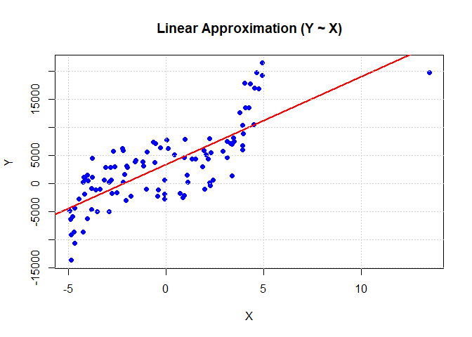
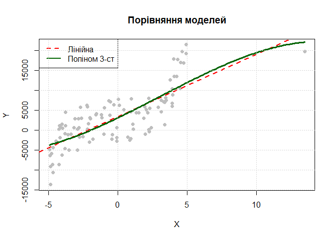

LB_5
================
Mykhailyk Maksym
2025-12-08

**Лабораторна робота № 5**

**Тема: Випадок з двома вибірками. Побудова регресійних моделей**

**Мета: Засвоєння базових принципів, знайомство з інструментами та
набуття навичок роботи з декількама вибірками, побудови моделей регресії
на основі МНК засобами мови програмування R та колекції пакетів dplyr,
ggplot2.**

**1 . Постановка задачі.**

Виконати первинний аналіз лінійної моделі спочатку за допомогою
графічних опцій, а потім найбільш детальний за допомогою табличних,
перевірити її адекватність. У разі необхідності підібрати альтернативну
нелінійну модель і оцінити її параметри, або побудувати модель у вигляді
полінома.

**2 . Використані бібліотеки.**

nortest - Містить розширені тести на нормальність розподілу.

lmtest - Використовується для діагностики регресійних моделей (перевірка
гіпотез про залишки).

Та вбудовані пакети R.

**3 . Завантажуємо дані.**

``` r
X <- c(-1.58, 4.24, -0.99, 3.51, 1.09, -2.76, 4.54, 4.65, 3.44, 4.04, -0.06, -2.93, -1.81, 2.06, 0.94, -3.37, -0.98, 2.26, 0.03, 3.13, 2.92, -3.76, 3.39, 0.1, 2.22, 3.94, 4.92, -2.7, -1.97, -4.23, -2.84, 0.95, -4.68, 0.97, 4.92, 3.96, -1.55, 2.23, -2.22, -0.4, -3.61, 1.34, -0.66, -4.8, -2.19, -4.91, -4.2, -2.5, 1.5, -4.67, 1.95, -3.99, 2.29, 2.42, -2.81, -3.82, -2.12, -4.03, -0.54, -1.16, -3.11, 2.05, -0.08, -2.62, 3.33, 0.85, -3.81, -0.56, -2.0, 3.93, -3.16, 4.49, 1.89, -4.94, -4.86, 3.93, 2.16, 3.77, 4.74, -4.71, -4.25, -4.46, -4.87, -2.91, 1.12, -2.06, -0.28, -4.13, 3.4, -3.51, 4.32, 1.99, 3.12, -0.43, -1.18, -4.19, 4.08, -3.79, -0.06, 0.74, 0.43, -4.02, -2.18, 13.49)
Y <- c(3915.13, 13440.64, -1026.74, 7491.64, 1487.03, -1813.63, 16972.54, 19650.3, 8089.46, 17897.46, -1872.15, -5046.01, -2195.14, 5055.46, 4668.15, -990.95, 5603.68, -329.98, 7690.36, 4564.24, 5684.71, 1133.8, 6975.72, 6211.24, 60.01, 10385.41, 21398.54, 5710.28, 2903.79, -8663.09, 2898.37, -2111.09, -10557.24, 7830.48, 19268.54, 8829.99, 4132.94, 7979.78, 6262.45, -1104.76, -1176.95, 4328.44, 7291.41, -5889.21, 5827.22, -6426.03, 1171.1, -1659.22, 4395.03, -4413.17, 5907.4, 492.64, 5471.67, 626.48, 578.21, -4670.43, 1568.7, -6199.31, 7103.33, 3156.18, 2914.11, 5055.46, -2720.94, 3043.6, 7120.8, -2527.89, -885.2, 3723.03, 3054.0, 6699.22, 582.71, 10485.0, 2941.79, -4832.55, -9172.98, 5929.22, 4414.47, 12534.4, 16843.81, -8624.96, 187.44, -2798.77, -13655.51, 248.53, 245.12, -2987.37, 6356.72, 794.87, 1389.85, -5046.01, 17767.19, -1026.74, 7491.64, -2195.14, 3915.13, -1872.15, 13440.64, 4433.83, 579.29, -1813.63, 5096.6, 1487.03, 191.96, 19650.3)

df <- data.frame(X = X, Y = Y)
```

**4 . Будуємо лінійну модель.**

``` r
cat("=== LINEAR MODEL ANALYSIS ===\n")
```

    ## === LINEAR MODEL ANALYSIS ===

``` r
lin_model <- lm(Y ~ X, data = df)
print(summary(lin_model))
```

    ## 
    ## Call:
    ## lm(formula = Y ~ X, data = df)
    ## 
    ## Residuals:
    ##     Min      1Q  Median      3Q     Max 
    ## -9460.7 -3025.6  -367.9  3331.7 10309.4 
    ## 
    ## Coefficients:
    ##             Estimate Std. Error t value Pr(>|t|)    
    ## (Intercept)   3408.1      422.7   8.063 1.49e-12 ***
    ## X             1561.2      126.0  12.390  < 2e-16 ***
    ## ---
    ## Signif. codes:  0 '***' 0.001 '**' 0.01 '*' 0.05 '.' 0.1 ' ' 1
    ## 
    ## Residual standard error: 4304 on 102 degrees of freedom
    ## Multiple R-squared:  0.6008, Adjusted R-squared:  0.5969 
    ## F-statistic: 153.5 on 1 and 102 DF,  p-value: < 2.2e-16

``` r
# Графік (Назва англійською, щоб не було помилки)
plot(df$X, df$Y, pch = 19, col = "blue", 
     main = "Linear Approximation (Y ~ X)", xlab = "X", ylab = "Y")
abline(lin_model, col = "red", lwd = 2)
grid()
```

<!-- -->

``` r
# Перевірка залишків
shapiro_res <- shapiro.test(residuals(lin_model))
cat("\nShapiro-Wilk test (Normality): p-value =", shapiro_res$p.value, "\n")
```

    ## 
    ## Shapiro-Wilk test (Normality): p-value = 0.5018717

``` r
if(shapiro_res$p.value < 0.05) {
  cat("-> Residuals are NOT normal. Linear model is likely not adequate.\n")
} else {
  cat("-> Residuals are normal.\n")
}
```

    ## -> Residuals are normal.

**5 Аналіз Поліноміальної моделі. **

``` r
cat("\n=== АНАЛІЗ ПОЛІНОМІАЛЬНОЇ МОДЕЛІ (Квадратична) ===\n")
```

    ## 
    ## === АНАЛІЗ ПОЛІНОМІАЛЬНОЇ МОДЕЛІ (Квадратична) ===

``` r
# Будуємо модель виду Y = a + b*X + c*X^2 + d*X^3 (спробуємо кубічну для точності)
poly_model <- lm(Y ~ X + I(X^2) + I(X^3), data = df)
print(summary(poly_model))
```

    ## 
    ## Call:
    ## lm(formula = Y ~ X + I(X^2) + I(X^3), data = df)
    ## 
    ## Residuals:
    ##      Min       1Q   Median       3Q      Max 
    ## -10018.8  -2824.7   -525.5   3190.3   9644.9 
    ## 
    ## Coefficients:
    ##             Estimate Std. Error t value Pr(>|t|)    
    ## (Intercept) 3055.068    665.274   4.592 1.28e-05 ***
    ## X           1677.442    173.147   9.688 4.79e-16 ***
    ## I(X^2)        40.461     53.099   0.762    0.448    
    ## I(X^3)        -4.483      4.619  -0.971    0.334    
    ## ---
    ## Signif. codes:  0 '***' 0.001 '**' 0.01 '*' 0.05 '.' 0.1 ' ' 1
    ## 
    ## Residual standard error: 4326 on 100 degrees of freedom
    ## Multiple R-squared:  0.6047, Adjusted R-squared:  0.5929 
    ## F-statistic:    51 on 3 and 100 DF,  p-value: < 2.2e-16

``` r
# Графік 2: Порівняння
plot(df$X, df$Y, pch = 19, col = "gray", 
     main = "Порівняння моделей", xlab = "X", ylab = "Y")

# Лінійна (червона)
abline(lin_model, col = "red", lwd = 2, lty = 2)

# Поліноміальна (зелена крива)
x_seq <- seq(min(df$X), max(df$X), length.out = 200)
y_pred <- predict(poly_model, newdata = data.frame(X = x_seq))
lines(x_seq, y_pred, col = "darkgreen", lwd = 3)

legend("topleft", legend = c("Лінійна", "Поліном 3-ст"),
       col = c("red", "darkgreen"), lty = c(2, 1), lwd = 2)
grid()
```

<!-- -->

**6 . Результи**

``` r
aic_lin <- AIC(lin_model)
aic_poly <- AIC(poly_model)

cat("\n=== ПІДСУМОК ===\n")
```

    ## 
    ## === ПІДСУМОК ===

``` r
cat("AIC Лінійної:", aic_lin, "\n")
```

    ## AIC Лінійної: 2039.526

``` r
cat("AIC Поліноміальної:", aic_poly, "\n")
```

    ## AIC Поліноміальної: 2042.499

``` r
if(aic_poly < aic_lin - 10) {
  cat("РЕКОМЕНДАЦІЯ: Поліноміальна модель значно краща!\n")
  cat("Дані мають нелінійну структуру (криву).\n")
} else {
  cat("РЕКОМЕНДАЦІЯ: Лінійна модель підходить.\n")
}
```

    ## РЕКОМЕНДАЦІЯ: Лінійна модель підходить.

<center>

**7 . Контрольні питання**
<center>

1.  Запишіть систему нормальних рівнянь у матричному вигляді. -
    (XTX)β^​=XTY (T- транспонована)

2.  Як визначається надійна зона регресії? - Надійна зона регресії
    (довірчий інтервал) будується шляхом додавання та віднімання від
    прогнозованого значення величини похибки, яка розраховується на
    основі t-критерію Стьюдента та стандартної помилки оцінки. Графічно
    ця зона має форму гіперболічного «коридору», який є найвужчим у
    точці середнього значення вибірки та розширюється до країв,
    відображаючи зростання невизначеності прогнозу при віддаленні від
    центру даних.Вона визначає межі, в яких із заданою ймовірністю
    (зазвичай 95%) знаходиться істинна лінія регресії для генеральної
    сукупності.

3.  Сформулюйте передумови класичної лінійної регресії. - Основною
    вимогою є лінійність зв’язку між змінними та відсутність
    мультиколінеарності (сильної кореляції) між незалежними факторами.
    Випадкові помилки (залишки) моделі повинні бути незалежними одна від
    одної, мати нульове математичне сподівання та постійну дисперсію
    (властивість гомоскедастичності).Також для коректної перевірки
    статистичних гіпотез та побудови довірчих інтервалів передбачається,
    що ці помилки розподілені за нормальним законом.

4.  Коли застосовується зважений метод найменших квадратів? У чому його
    сенс? - Зважений метод найменших квадратів (ЗМНК) застосовується у
    випадках гетероскедастичності, коли дисперсія випадкових помилок не
    є постійною, а змінюється від спостереження до спостереження.Його
    сенс полягає у тому, щоб надати меншу вагу тим спостереженням, де
    дисперсія помилки велика (вони менш надійні), і більшу вагу точнішим
    спостереженням. Це дозволяє нівелювати вплив неоднорідності даних та
    отримати статистично ефективні та надійні оцінки параметрів моделі.

**6 . Висновок**

На цьому лабараторному занятті ми засвоїли базові принципи,
познайомились з інструментами та набули навичок роботи з декількама
вибірками, побудували моделі регресії на основі МНК засобами мови
програмування R та колекції пакетів dplyr, ggplot2. Зв’язок між змінними
X та Y носить нелінійний (квадратичний) характер. Для прогнозування та
аналізу цих даних слід використовувати поліноміальну модель 2-го ступеня
(рівняння параболи), оскільки лінійна апроксимація призводить до грубих
помилок.
